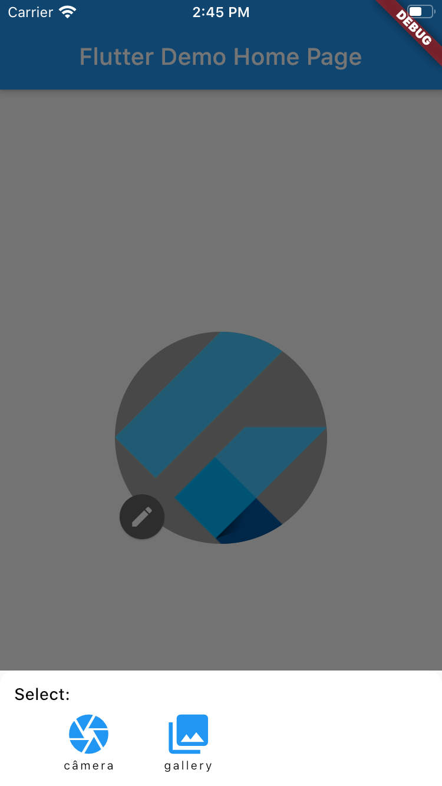

# image_picker_widget

[](https://pub.dev/packages/image_picker_widget)


A new Flutter package to integrate image_picker with a simple Flutter widget, allowing you to edit an image without any problems with design code development

| Preview | Modal image type picker |
|---------|----------|
| |  |

## Getting Started

Add the dependency in `pubspec.yaml`:

```yaml
dependencies:
  ...
  # Design
  image_picker_widget: '>=2.0.0 <3.0.0 /// For pre null-safety, use version 1.0.3'
```

A Flutter plugin for iOS and Android for picking images from the image library,
and taking new pictures with the camera.

## Installation

Since this package requires `image_picker`, you need to add this requirements bellow.

### iOS

Add the following keys to your _Info.plist_ file, located in `<project root>/ios/Runner/Info.plist`:

* `NSPhotoLibraryUsageDescription` - describe why your app needs permission for the photo library. This is called _Privacy - Photo Library Usage Description_ in the visual editor.
* `NSCameraUsageDescription` - describe why your app needs access to the camera. This is called _Privacy - Camera Usage Description_ in the visual editor.
* `NSMicrophoneUsageDescription` - describe why your app needs access to the microphone, if you intend to record videos. This is called _Privacy - Microphone Usage Description_ in the visual editor.

### Android

#### API 29+
No configuration required - the plugin should work out of the box.

#### API < 29

Add `android:requestLegacyExternalStorage="true"` as an attribute to the `<application>` tag in AndroidManifest.xml. The [attribute](https://developer.android.com/training/data-storage/compatibility) is `false` by default on apps targeting Android Q. 

______________

## Parameter (Required)
-  `diameter` - The diameter of the container in which the image is contained.

## Parameter (Optional)
- `initialImage` - The initial image to be displaied, can be an `ImageProvider`, `File` or a `external url (String)`
- `isEditable` - Checks whether the image can be changed
- `onChange` - Case the image can be changed, this function will be called after the change.

## Customization (Optional)

### Image Picker Widget
- `shape` - The shape of the widget [`square` or `circle`]
- `backgroundColor` - The background of the widget [default to `Colors.grey[500]`]
- `editIcon` - The widget that references the possibility of editing

### Modal image type picker
- `modalTitle` - The title of the widget [default to `Text` > "Select:"]
- `modalCameraIcon` - The camera icon that selects the camera [default to `Icons.camera`]
- `modalCameraText` - The camera label that indicates to selects the camera [defaults to `Text` > "camera"]
- `modalGalleryIcon` - The gallery icon that selects the gallery [default to `Icons.collections`]
- `modalGalleryText` - The gallery label that indicates to selects the gallery [defaults to `Text` > "gallery"]

## Basic Usage

Adding the widget

```dart
..child: ImagePickerWidget(
    diameter: 180,
    // initialImage: "https://strattonapps.com/wp-content/uploads/2020/02/flutter-logo-5086DD11C5-seeklogo.com_.png",
    shape: ImagePickerWidgetShape.circle, // ImagePickerWidgetShape.square
    isEditable: true,
    onChange: (File file) {
        print("I changed the file to: ${file.path}");
    },
)
```

## Issues

Please if you see any issues, bugs, or feature requests, send to me in: [GitHub issue](https://github.com/JulioCGMC/image_picker_widget/issues).